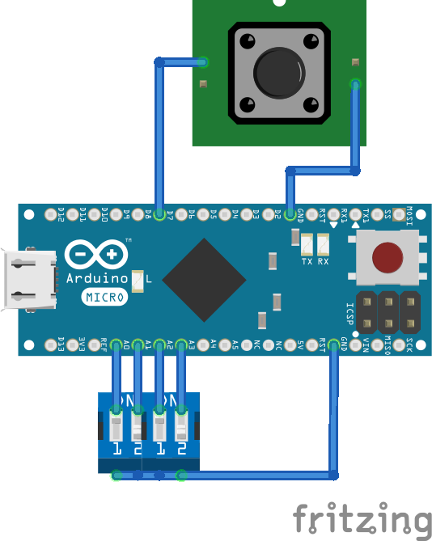
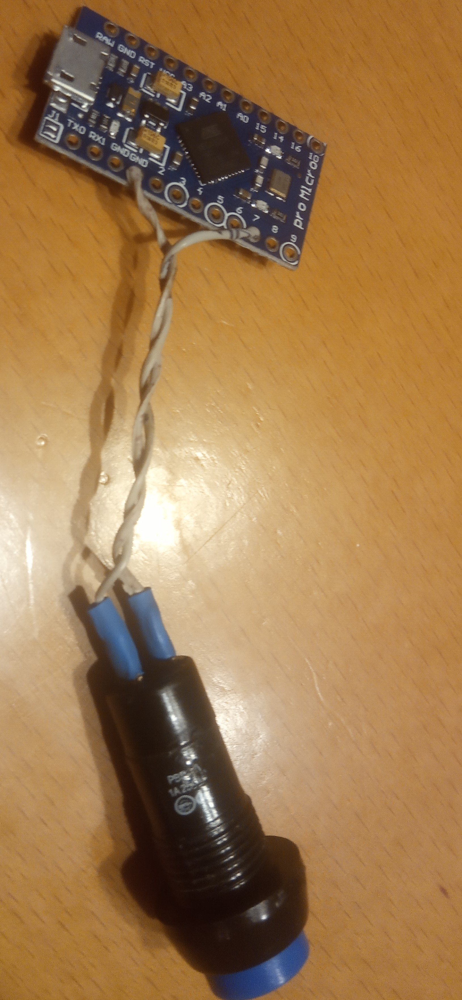

# Urządzenie sluży do wypełniania formularzy.
Aby wstawić tabulator, oznaczający przejście do następnego pola, użyj lewego ukośnika.

[Leonardo](https://allegro.pl/oferta/pro-micro-atmega32u4-avr-leonardo-5v-16mhz-17280189654)
